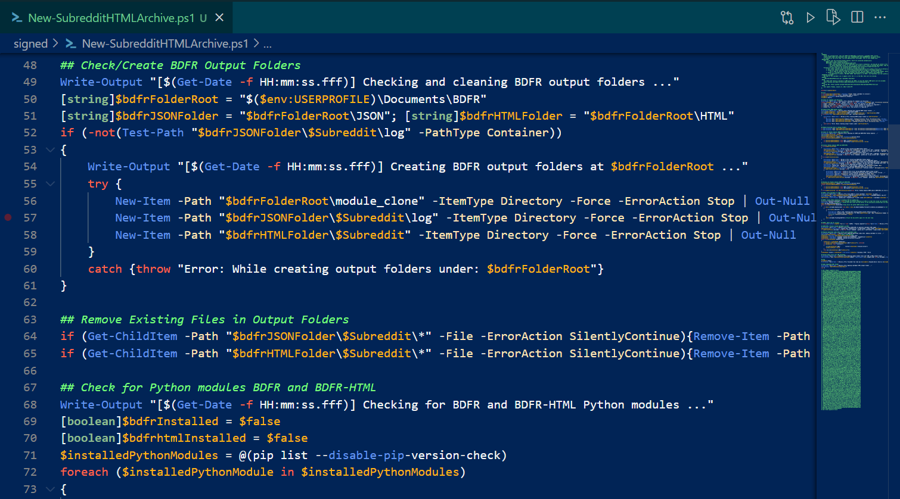

# tokenColorThemes
PowerShell token color customization themes for VSCode and the old ISE.

VSCode: drop settings.json here: %APPDATA%\Code\User\settings.json

ISE: Tools > Options... > Manage Themes > Import... > ISE.StorableColorTheme.ps1xml > Select (Customized Theme) > OK > OK

Screenshot of VSCode with theme applied:

